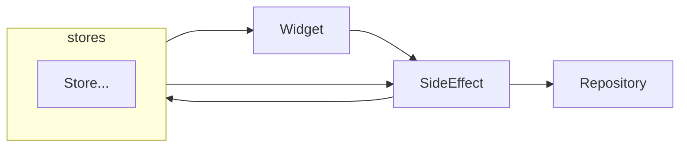

## Features
One way state management. Thin wrapper.
Use StateNotifier and RiverPods.

## Getting started
Add `baguette` and [`flutter_riverpod`](https://github.com/rrousselGit/riverpod) to Pubspec.yaml.

## Usage
`Store` and `SideEffect` in the upper figure use this library, `State` uses `freezed` etc., `Repository` could be anything.
`Store` subscription uses `Riverpods`.
See the example for details.

## Additional information

